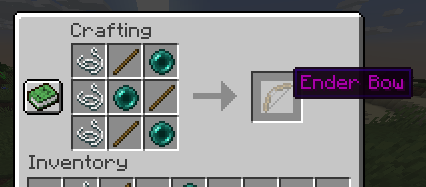
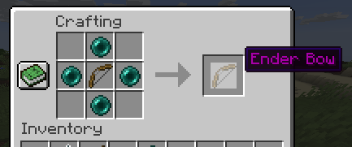

# EnderBow

Like normal bow, but shoots ender pearls.

It's my implemetation of the ender bow guide found at spigotmc.org developer wiki or [here](https://www.spigotmc.org/wiki/enderbow-an-easy-first-plugin/).

It has some tweaks and different command and crafting recepies.

## Crafting

The crafting recepies I made for this custom Ender Bow plugin.

Ender Bow ^

Upgrade normal bow to Ender Bow ^

## Building

The project can be built easily with Apache Maven by running "mvn compile".
Then that will spit out a target forlder with the .jar files and some other stuff.
